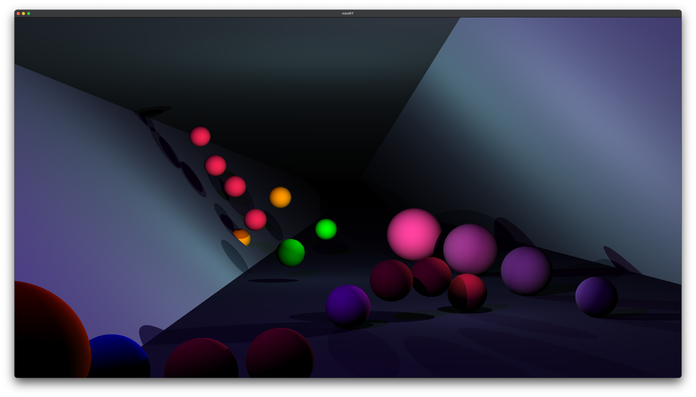

# 🌞 Mini Ray Tracer — made with ❤️ and 🧠



- For more images visit → [The Gallery](https://rubennijhuis.com/projects/minirt)


<br>


## 🏃‍♀️ —  Quick Start
It's very important to clone recursively as this project contains submodules!
```sh
$ git clone --recursive git@github.com:RubenNijhuis/Mini-Ray-Tracer.git
$ make run
```

If you're on Linux(Debian-like), you have to install the prerequisites for [MLX42](https://github.com/codam-coding-college/MLX42/) first:
```sh
sudo apt install build-essential libx11-dev libglfw3-dev libglfw3 xorg-dev
```

<br>

## 🏗 — Project structure
```
Mini-Ray-Tracer -/
  - 🖼 assets -/    # All types of assets, output img
  - 📦 bin -/       # Mini-Ray-Tracer output
  - 👀 include -/   # The .h files of the project
  - 📚 libs -/      # Our custom and vendor libraries
  - ⛲️ src -/       # Source files
  - 🧪 test -/      # Testing directory
  - .gitmodules     # Describes what submodules are installed
  - Makefile        # Compiling && linking magic happens here
  ...
```

<br>

## 🗣 — Command list
```sh
$ make norm
Outputs the norminette across the src and include folder of every project

$ make test
Test the functions of MiniRT using Criterion

$ make run
Run the program with a default file test from the assets folder

$ make submodules
Pulls the most recent versions of the submodules 
!! BEWARE !! this could import breaking changes
```

<br>

## 🎪 — Module folder structure

In this project we tried to adhere to a more modular structure of our project. Creating components that have one entry point and abstract the inner-workings.

Each module has a folder and file that match name-wise. Every other file can be seen as a part of that bigger module. In some cases some functions might be exposed to the larger project as it follows the DRY principle more.

```
📁 Folder name
  - File with that same folder name (this is the module entry point)
  - ...supporting files
  - Potential README explaining the setup and usage
```

<br>

## 🧪 — Testing
```sh
$ make test
Test the functions of MiniRT using Criterion
```
→ [Criterion Testing Library](https://github.com/Snaipe/Criterion)

<br>

## 📝 — Notes
[Scratchapixel →](https://www.scratchapixel.com/)  
[rotation Matrix →](https://en.wikipedia.org/wiki/rotation_matrix)  

<br>

## ☑️ — Todo
[ ] - Make wayyy more tests  
[ ] - Program close on [ x ] button click  

